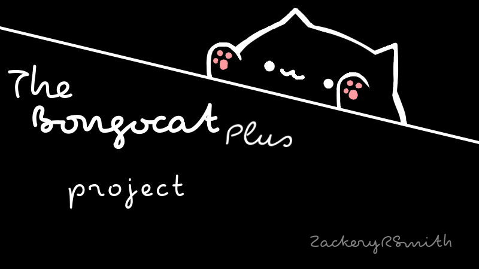
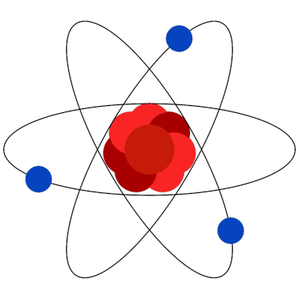
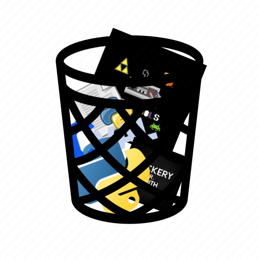

----

**README-toppings**, a delightful compilation of curated toppings sourced from a multitude of README files I've created, combined with unique creations designed exclusively for this project.

*Use and claim these toppings as you like*, no need to credit me if you don't want to :)

Toppings are seperated by 8 lines of whitespace, E.g.
        
This amount of spacing ^

----
<!--
  -- START OF BONGOCAT PLUS
  -->

<!-- PROJECT LOGO -->
 

  

<!-- BUILD STATUS' -->

  
  <!---->
  <!---->
  
  <!---->
  <!---->
  
  <!---->
  <!---->

<h3 align="center">Bongocat Plus</h3>
  

    The extensible and highly configurable Bongo Cat overlay!
     
    <a href="https://github.com/kuroni/bongocat-osu"><strong>Original Project</strong></a>
      
    <a href="https://github.com/ZackeryRSmith/bongocat-plus/issues">Report Bug</a>
    ·
    <a href="https://github.com/ZackeryRSmith/bongocat-plus/issues">Request Feature</a>
  

<!--
  -- END OF BONGOCAT PLUS
  -->

        

<!--
  -- START OF CVAL
  -->
  
<!-- PROJECT LOGO -->
 

  

<h3 align="center">Cval</h3>

  

    A layer of protection for eval
     
    <b>
      <a href="https://github.com/ZackeryRSmith/cval/#examples">View Examples</a>
      ·
      <a href="https://github.com/ZackeryRSmith/cval/issues">Report Bug</a>
    </b>
  

<!--
  -- END OF CVAL
  -->
  
        

<!--
  -- START OF NEWTRODIT (Actual project is made by Anic17)
  -->

> **Note**
After almost a year and a half after the first release, Newtrodit 0.6 rc-1 is out! Feel free to try it, and remember, all feedback is highly appreciated!

#### [💡 Features](https://github.com/anic17/Newtrodit#features) - [📖 Compatibility](https://github.com/anic17/Newtrodit#compatibility) - [⚙️ Configuration](https://github.com/anic17/Newtrodit#configuration) - [🔨 Build](https://github.com/anic17/Newtrodit#building) - [❔ Contributors](https://github.com/anic17/Newtrodit#contributors)

# Newtrodit     

**Efficient and simple** *yet powerful* console text editor written in C

<!--
  -- END OF NEWTRODIT (Actual project is made by Anic17)
  -->

        

<!--
  -- START OF PLACELESS-SCRIPTS
  -->

<!-- PROJECT LOGO -->
 

  

<h3 align="center">placeless-scripts</h3>

  

    Scripts that just don't deserve their own repo
     
    <a href="wait for this to be implemented"><strong>Get a Random Script</strong></a>
      
    <a href="https://github.com/ZackeryRSmith/junk/issues">Report Bug</a>
    ·
    <a href="https://github.com/ZackeryRSmith/junk/issues">Request Feature</a>
  

<!--
  -- END OF PLACELESS-SCRIPTS
  -->

        

<!--
  -- START OF TERMBOT (Actual project is made by polyzium)
  -->

<h1 align="center">
    Termbot
</h1>

A fully fledged terminal emulator in a Discord chat, inspired by <a href="https://github.com/Adikso/BashBot">BashBot</a>

    
    
    
    

<!--
  -- END OF TERMBOT (Actual project is made by polyzium)
  -->

        

<!--
  -- START OF DISCORDTOKA
  -->

<!-- PROJECT LOGO -->
 

  

<h3 align="center">DTA (Toka)</h3>

  

    Taking a deep dive into discord token analysis
     
    <a href="https://github.com/ZackeryRSmith/discordtoka/"><strong>Explore Docs! »</strong></a>
     
     
    <a href="https://github.com/ZackeryRSmith/discordtoka/">View Examples</a>
    ·
    <a href="https://github.com/ZackeryRSmith/discordtoka/issues">Report Bug</a>
    ·
    <a href="https://github.com/ZackeryRSmith/discordtoka/issues">Request Feature</a>
  

<!--
  -- END OF DISCORDTOKA
  -->
